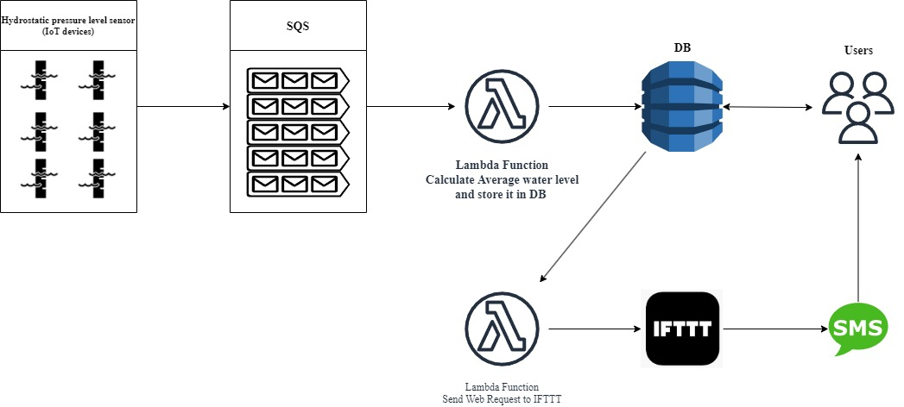
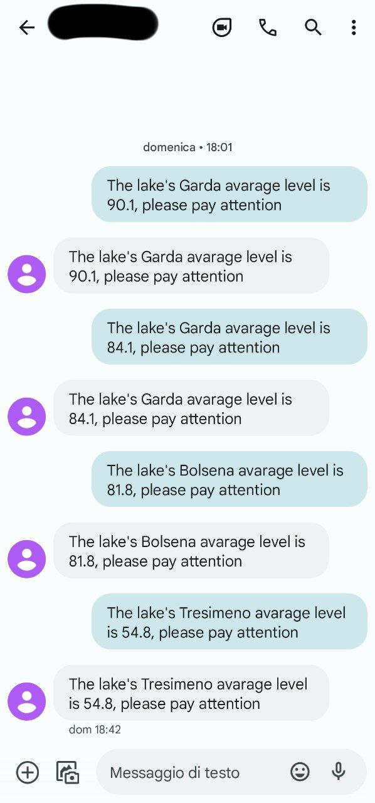
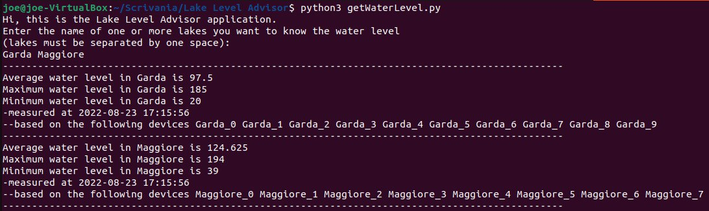

<div id="top"></div>

# Lake Level Advisor
## Introduction
"Lake Level Advisor" it's a serverless application that give people information about lake's water level and send sms when the water level it's too low or to high.<br>
This system may be useful to warn people in case of risk of overflowing or perhaps to inform farmers that are watering their crops with that lake's water.


### IoT infrastructure  

We're considering a Hydrostatic pressure level sensor distributed every 25 km^2 of surface for the 5 largest italians lake.<br>
This is gonna provide us information about the average lake's water level and information about the minimum and maximum water's level.  

<p align="right">(<a href="#top">back to top</a>)</p>

## Project architecture



The IoT devices of a certain lake will provide the measures to the relative queues, after that 2 different lamda function  
* Every minute, a time-triggered Serverless function calculates the average, the minimum and maximum water level for every lake(aka. every queue) and store this information in the database that can be accessed from the user as much as he like.
* Every minute, a message-triggered Serverless function calculates assert that the average water level is within a certain range otherwise, throw an ifttt applet a sms will be sent.  

<p align="right">(<a href="#top">back to top</a>)</p>

## Installation
### Prerequisites

* [Docker](https://docs.docker.com/get-docker/)
* [AWS CLI](https://docs.aws.amazon.com/cli/latest/userguide/getting-started-install.html)
* [boto3](https://boto3.amazonaws.com/v1/documentation/api/latest/guide/quickstart.html)

<p align="right">(<a href="#top">back to top</a>)</p>

### Getting Started

1. Clone the repository
   ```sh
   git clone https://github.com/Joe-cyber/LakeLevelAdvisor
   ```
2. Launch LocalStack
   ```sh
   docker run --rm -it -p 4566:4566 -p 4571:4571 localstack/localstack
   ```
3. Create a SQS queue for each shop
   ```sh
   aws aws sqs create-queue --queue-name Garda --endpoint-url=http://localhost:4566
   ```   
    ```sh
   aws sqs create-queue --queue-name Maggiore --endpoint-url=http://localhost:4566
   ```  
    ```sh
   aws sqs create-queue --queue-name Como --endpoint-url=http://localhost:4566
   ```  
    ```sh
   aws sqs create-queue --queue-name Tresimeno --endpoint-url=http://localhost:4566
   ```  
    ```sh
   aws sqs create-queue --queue-name Bolsena --endpoint-url=http://localhost:4566
   ``` 
   You can check that the queues has been actually created using the command:
    ```sh
   aws sqs list-queues --endpoint-url=http://localhost:4566
   ``` 
   
4. Create the DynamoDB table
   ```sh
   python3 settings/createTable.py
   ``` 
   You can check that the table has been actually created using the command:
    ```sh
   aws dynamodb list-tables --endpoint-url=http://localhost:4566
   ``` 
5. Populate the tables with initial data (Optional)
    ```sh
   python3 settings/loadData.py
   ``` 
- Check the value of the entire database with populate tables
    ```sh
   aws dynamodb scan --table-name Lakes --endpoint-url=http://localhost:4566
   ``` 
6. create the zip, lambda function and attach the policy
- Create the role and attach the policy  
    ```sh
  aws iam create-role --role-name lambdarole --assume-role-policy-document file://settings/role.json --query 'Role.Arn' --endpoint-url=http://localhost:4566
   ``` 
    ```sh
  aws iam put-role-policy --role-name lambdarole --policy-name lambdapolicy --policy-document file://settings/policy.json --endpoint-url=http://localhost:4566
   ``` 
- Create the zip file
   ```sh
  zip avgFunc.zip settings/avgFunc.py
   ``` 
- Create the lambda function and save the Arn
    ```sh
  aws lambda create-function --function-name avgFunc --zip-file fileb://avgFunc.zip --handler settings/avgFunc.lambda_handler --runtime python3.6 --role arn:aws:iam::000000000000:role/lambdarole --endpoint-url=http://localhost:4566

   ```
7. Set up a rule to trigger the Lambda function every minute
- Create the rule and save the Arn
    ```sh
  aws events put-rule --name calculateAvg --schedule-expression 'rate(1 minutes)' --endpoint-url=http://localhost:4566
   ``` 
  You can check that the rule has been actually created using the command:
    ```sh
   aws events list-rules --endpoint-url=http://localhost:4566
   ``` 
- Add permissions to the rule 
    ```sh
  aws lambda add-permission --function-name avgFunc --statement-id calculateAvg --action 'lambda:InvokeFunction' --principal events.amazonaws.com --source-arn arn:aws:events:us-east-1:000000000000:rule/avgFunc --endpoint-url=http://localhost:4566
   ```
  
- Add the lambda function to the rule using the JSON file 
   ```sh
  aws events put-targets --rule calculateAvg --targets file://settings/targets.json --endpoint-url=http://localhost:4566
   ``` 
_Now every minute the function countFunc will be triggered._

<p align="right">(<a href="#top">back to top</a>)</p>

## Setting IFTT
1. Go to https://ifttt.com/
2. Create a new applet.
3. Click "If This", type "webhooks" and choose the Webhooks service
4. Select "Receive a web request", write "dangerous-water-level" and create "trigger".
5. Click Then That, type "Android SMS integrations"
6. Click Android SMS integrations and choosing the topic and the body (Pay attention, this requires that the ifttt app is installed on your phone) 
7. Save your key and copy it into the summary.py
8. Zip the file and create the Lambda function
    ```sh
   zip smsNotification.zip smsNotification.py
    ```
    ```sh
   aws lambda create-function --function-name smsNotification --zip-file fileb://smsNotification.zip --handler smsNotification.lambda_handler --runtime python3.6 --role arn:aws:iam::000000000000:role/lambdarole --endpoint-url=http://localhost:4566
    ```
9. Create the event source mapping 
    ```sh
   aws lambda create-event-source-mapping --function-name smsNotification --batch-size 5 --maximum-batching-window-in-seconds 60 --event-source-arn arn:aws:sqs:us-east-1:000000000000:Summary --endpoint-url=http://localhost:4566
    ```
    
The output should be more similar to this: <br><br>



## Usage
1. Simulate the devices
    ```sh
   python3 IoTDevices.py
    ```
2. Wait or invoke Lambda function manually
   ```sh
   aws lambda invoke --function-name avgFunc --payload fileb://settings/lakes.json out --endpoint-url=http://localhost:4566
    ```
3. Check the water level of the lakes throw the command
   ```sh
   python3 getWaterLevel.py
    ```
4. Receive the sms notification by invoking the other lambda function
    ```sh
   aws lambda invoke --function-name smsNotification --payload fileb://settings/lakes.json out --endpoint-url=http://localhost:4566
    ```
Below you can see an example of execution



<p align="right">(<a href="#top">back to top</a>)</p>


<!-- CONTACT -->
## Contact

Caliendo Gioacchino - caliendo.gioacchino00@gmail.com

Project Link: [https://github.com/Joe-cyber/LakeLevelAdvisor](https://github.com/Joe-cyber/LakeLevelAdvisor)

<p align="right">(<a href="#top">back to top</a>)</p>